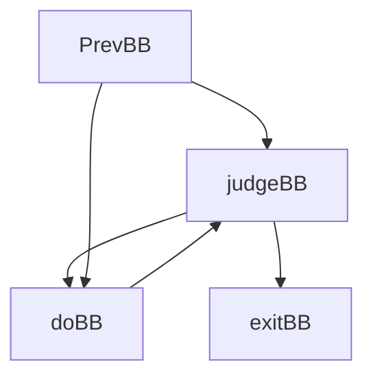

# Lab5 实验报告-阶段一

队长         朱恩佐        PB18111704

队员         孙宁            PB18111779

## 实验要求

阅读LoopSearch和Mem2reg的代码，了解Pass对LightIR中间代码的优化模式。

## 思考题
### LoopSearch
Q1：循环的入口如何确定？循环的入口的数量可能超过1嘛？

ANS： 

```c++
		for (auto n : *set)
    {
        for (auto prev : n->prevs)
        {
            if (set->find(prev) == set->end())  //当set中一个结点的某个前驱不在这个set中时，这个结点就是循环的base
            {
                base = n;
            }
        }
    }
    if (base != nullptr)
        return base;
    for (auto res : reserved)
    {
        for (auto succ : res->succs)
        {
            if (set->find(succ) != set->end())  //当reserved中一个结点的后继在set中，则base为这个后继结点
            {
                base = succ;
            }
        }
    }
```

循环入口确定：当强连通分量集合set中有一个node的某个前驱结点不在这个set里，则这个结点就是循环入口结点，这个结点的node->bb是循环入口。当上述情况不成立时，即每个node的前驱结点都在这个强连通分量集合中时（如：多重循环中没有中间语句的第二个bb），如果reserved集合中结点的后继结点在set中，则这个结点就是循环入口结点。

循环入口数不可能超过1：

如果一个循环存在多个入口，不妨设这个入口是doBB，那么如果这个入口连接的BB来自PrevBB（这里我们认为PrevBB是judgeBB前所有的BB）：



那么我们考虑合并强连通分量之后的图，prev这一部分就会出现多个出口。这显然不太符合一个流图的性质。（会导致层次不对。）

另外一种情况就是如果这条边来自exitBB，那么也就意味着judgeBB、doBB和exitBB成为了一个强连通分量。也不符合条件。

从上述代码可以看出，如果第一个for循环中找到了前驱结点不在set中的结点，则找到一个base并返回。当第一个for循环没有找到循环入口，则会进入第二个for循环，查找reserved中的结点，从而找到一个base。因此一个循环的入口数不可能超过1

Q2: 简述一下算法怎么解决循环嵌套的情况。

ANS：循环的查找是从外向内的。当结束了外层循环后，将该循环的入口存入reserved中

```
								reserved.insert(base);         
```

然后将base结点删除，分别将base结点从其前驱和后继结点的相应关系中删除。

```
								nodes.erase(base);
  							for (auto su : base->succs)
                {
                    su->prevs.erase(base);
                 }
                 for (auto prev : base->prevs)
                 {
                     prev->succs.erase(base);
                 }
```

然后将外层循环的集合删除，所有结点重新初始化，继续查找下一个强连通分量

```
 										for (auto scc : sccs)
                        delete scc;
                    sccs.clear();
                    for (auto n : nodes)
                    {
                        n->index = n->lowlink = -1;
                        n->onStack = false;
                    }
```


### Mem2reg
Q1:请简述支配边界的概念

ANS： 流图中，结点n的支配边界为从n可达的第一个汇合点的集合。（汇合点指有两个及以上的前驱结点）

Q2:请简述$\phi$节点的概念，与其存在的意义。 

ANS: $\phi$函数是将该程序块的活跃变量在其前驱结点的名字映射到该程序块的新名字的一个映射函数。其意义是确保了对任意使用处都只有一个定义能够到达，使得编译器可以重命名每个使用处的变量和临时值，以反映到达该处的定义。

Q3:请描述`Mem2Reg Pass`执行前后的`ir`的变化, 简述一下。

ANS: gcd函数中，原来的代码将参数%arg0,%arg1分别存入了%op2,%op3中，引用这两个参数时，需要先load到新的地址空间再使用。经过Mem2Reg Pass后，省略了store部分的代码，在需要的地方直接引用参数%arg0,%arg1。简化了IR代码。

```
before:
  %op2 = alloca i32
  store i32 %arg0, i32* %op2
  %op3 = alloca i32
  store i32 %arg1, i32* %op3
  %op4 = load i32, i32* %op3
  %op5 = icmp eq i32 %op4, 0
after:
  %op5 = icmp eq i32 %arg1, 0
```

```
before:
  		%op9 = load i32, i32* %op2
  		ret i32 %op9
 after:
 			ret i32 %arg0
```

```
before:
	%op11 = load i32, i32* %op3
  %op12 = load i32, i32* %op2
  %op13 = load i32, i32* %op2
  %op14 = load i32, i32* %op3
  %op15 = sdiv i32 %op13, %op14
after:
  %op15 = sdiv i32 %arg0, %arg1
```

​		main函数中，原来的代码在调用了两次input( )函数后，将读入的值存入了新的地址空间。每次引用时，需要先load到新的地址中。Mem2Reg Pass后，引用这两个数据可以直接使用%op3,%op4.

```
before:
	%op0 = alloca i32
  %op1 = alloca i32
  %op2 = alloca i32
  %op3 = call i32 @input()
  store i32 %op3, i32* %op0
  %op4 = call i32 @input()
  store i32 %op4, i32* %op1
after:
	%op3 = call i32 @input()
  %op4 = call i32 @input()
```

```
before:
	%op5 = load i32, i32* %op0
  %op6 = load i32, i32* %op1
  %op7 = icmp slt i32 %op5, %op6
after:
	%op7 = icmp slt i32 %op3, %op4
```

​		在遇到分支跳转时，多个分支模块在结束前会将名字相同的活跃变量存入的相同的地址中，方便后续模块使用该变量。Mem2Reg Pass后，分支模块对于相同的变量使用了不同的地址，汇合模块，使用phi 函数，将相同变量在不同模块的地址映射到汇合模块的地址上。

```
//该程序块有两个后续模块label10,label14. label10的后续模块为label14
br i1 %op9, label %label10, label %label14 
label10:
before:
	preds = %label_entry
  %op11 = load i32, i32* %op0
  store i32 %op11, i32* %op2
  %op12 = load i32, i32* %op1
  store i32 %op12, i32* %op0
  %op13 = load i32, i32* %op2
  store i32 %op13, i32* %op1
  br label %label14 
after:
	preds = %label_entry
  br label %label14
label14:
before:
	%op15 = load i32, i32* %op0
  %op16 = load i32, i32* %op1
  %op17 = call i32 @gcd(i32 %op15, i32 %op16)
after:
	%op19 = phi i32 [ %op3, %label10 ], [ undef, %label_entry ]
  %op20 = phi i32 [ %op4, %label_entry ], [ %op3, %label10 ]
  %op21 = phi i32 [ %op3, %label_entry ], [ %op4, %label10 ]
  %op17 = call i32 @gcd(i32 %op21, i32 %op20)
```

Q4: 在放置phi节点的时候，算法是如何利用支配树的信息的？

ANS: 首先确定了活动于多个程序块的变量名字的集合Globals, 对于Globals中的每个名字x,维护使用过这个变量名的block的集合Block(x)。对每个全局名字x,WorkList初始化为Block(x)，对WorkList上的每个基本块b，在b的支配边界DF(b)的每个程序块d的起始处并行插入$\phi$函数。插入函数后，将d也加入x的WorkList中。

Q5: 算法是如何选择`value`(变量最新的值)来替换`load`指令的？（描述数据结构与维护方法）

ANS：利用了栈和计数器。每一个全局名字使用一个计数器和一个栈。每个定义处，算法通过将目标名字的当前计数器值压栈来产生新的下标，并将计数器加1。处理程序块的最后一步，算法将该程序块中的产生的所有名字从栈中弹出，恢复到该程序块直接支配结点末尾处的当前静态单赋值形式名字集合。

### 代码阅读总结

了解了Pass的优化模式。

对编译器分配寄存器的方式进行了了解。

对于各种代码在流图中的结构有了一些了解。

### 实验反馈 （可选 不会评分）

对本次实验的建议

### 组间交流 （可选）

本次实验和哪些组（记录组长学号）交流了哪一部分信息
